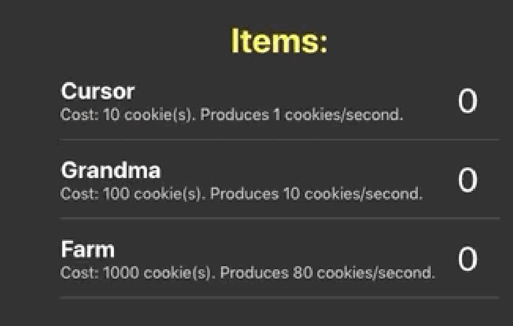

# Exercise 1: Finishing the UI

First, let's take a look at the structure. We'll find React Router in our `App` component.

There are two routes, our root `/` that renders `Home`, and `/game` which renders `Game`. We'll focus mostly on `Game`.

Our `Game` file has an array of items:

```js
const items = [
  { id: "cursor", name: "Cursor", cost: 10, value: 1 },
  { id: "grandma", name: "Grandma", cost: 100, value: 10 },
  { id: "farm", name: "Farm", cost: 1000, value: 80 },
];
```

`cost` is how many cookies the items cost. `value` is how many cookies the item generates per second.

## Item sidebar

You can see that we aren't using this data anywhere yet, and we have a TODO in our component:

```js
<ItemArea>
  <SectionTitle>Items:</SectionTitle>
  {/* TODO: Add <Item> instances here, 1 for each item type. */}
</ItemArea>
```

This section will represent this part of the UI:



Create a new `<Item>` component in a new file, `Item.js`. To start, create the markup from the image above using a hardcoded item (you can pick the first item from the `items` array in `Game.js`). Once you have it rendering correctly, swap out the hardcoded values for props (eg. change `<Name>Cursor</Name>` to `<Name>{name}</Name>`, with `name` being defined in the component props).

In our `Game` component, map over the `items` array, and create 1 `<Item>` component for each item, passing in the right props.

There are two additional "special" props we need: `numOwned` and `handleClick`.

`numOwned` will tell the component how many of this item are currently owned by the player, and will be displayed as a big number on the right side. For now, you can use the `purchasedItems` object in the Game component; we'll replace this with React state shortly.

For `handleClick`, we want to pass a function. For now it can just log to the console.

**Remember:** You should never put click-handlers on `<div>` or `<li>` elements. Only on things meant to be clicked on, like `<button>` and `<a>`.

---

[Back to the README.md](../README.md)

[Next Exercise](./exercise-2.md)